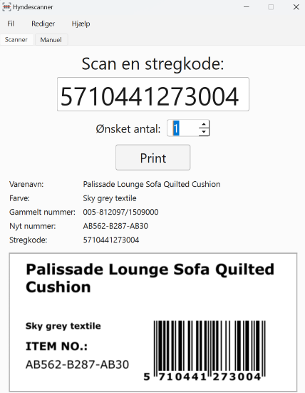

# HyndeScanner 2.0

### A self-correcting tool for printing item labels.

* Facilitates common warehouse jobs like item labeling and re-labeling,
* Prints the correct label automatically by just scanning the barcode,
* Allows manual label selection,
* Can be easily updated with new items,
* Known errors can be quickly registered and will be taken care of automatically, with minimal user input required.